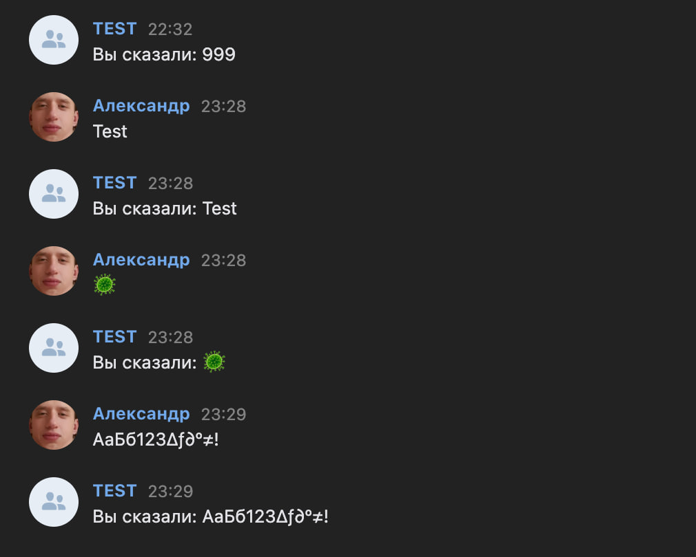

# VK Echo-Bot


## Описание:
Бот для ВКонтакте, отвечающий пользователю, дублируя его сообщение.

## Требования:
- Java 17+
- Gradle
- Учетная запись ВКонтакте
- Сервер для хостинга бота

## Конфигурация проекта
В файле `application.properties` в директории `src/main/resources` необходимо ввести требуемые **VK API токены**:
```properties
spring.application.name=vk-echo-bot
server.port=8080

vk.token.access=
vk.token.confirmation=

vk.rest.messages.send=https://api.vk.com/method/messages.send?
```
Также вы можете заменить порт на котором будет запускаться приложение `server.port=<your_port>`.

***В следующем шаге описан процесс получения токенов `vk.token.acces` и `vk.token.confirmation`.***

## Получение токенов VK API:
1. **Создайте сообщество ВКонтакте**:
   - Перейдите на страницу ВКонтакте и создайте новое сообщество (например, "TEST").

2. **Получите ключ доступа (access_token)**:
   - Перейдите в раздел "Управление" -> "Работа с API" -> "Ключи доступа".
   - Создайте новый ключ доступа и выберите необходимые права доступа (например, отправка сообщений, чтение сообщений). Скопируйте этот ключ и вставьте в поле `vk.token.acces`
     в `application.properties`.

3. **Настройте Callback API**:
   - Перейдите в раздел "Управление" -> "Callback API".
   - Нажмите "Создать сервер" и укажите URL вашего сервера (например, если вы используете ngrok, это будет ваш URL, сгенерированный в ngrok + путь до REST контроллера:
   `http://<ngrok-url>/api/v1/vk/callback`).
   - Установите секретный ключ, скопируйте его и вставьте в поле `vk.token.confirmation` в `application.properties`.
   - Включите события, на которые бот будет реагировать (например, входящие сообщения).
  
## Запуск проекта:
- Через Gradle:
   ```bash
   ./gradlew bootRun
   ```
- Или используйте стандартные средства IDE.


## Пример использования:


